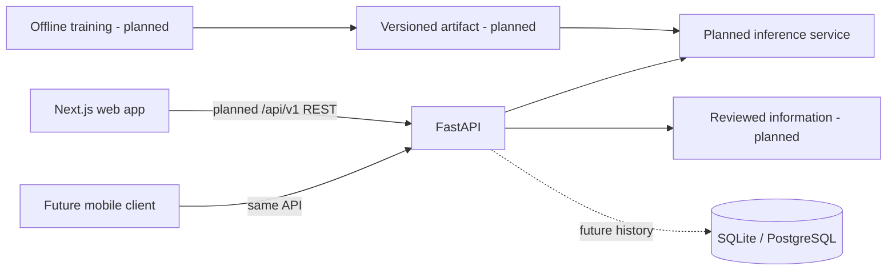

# Smart Agriculture — AI Plant Disease Detection System

**HORTI** is a computer vision portfolio project for plant disease detection and future
crop monitoring. The planned web application will accept leaf photographs, show model
predictions and confidence scores, and provide reviewed disease information.

## Motivation and objectives

Visual symptoms can be difficult to interpret, and classifiers may perform worse in the
field than on curated datasets. This project explores an inexpensive educational tool
while developing skills in API design, backend engineering, reproducible ML, testing and
deployment. Predictions will be estimates, not confirmed diagnoses.

## Current status and planned features

Foundation stage. Present: FastAPI factory, GET /health and health/CORS test cases,
environment loader, origin allowlist, static Next.js landing page, dependency locks,
quality tools, CI definition and documentation. Frontend production build and static
checks are validated. **Backend runtime tests are not validated:** Windows Application
Control blocks Pydantic's native extension during collection, including an escalated
retry. GitHub CI has not run. See [validation notes](docs/VALIDATION.md).

Planned MVP: validated leaf uploads, classification for a small crop set, confidence and
uncertainty warnings, reviewed descriptions, responsive results and loading/error states.
No upload, prediction, training, database, accounts, history or deployment is implemented.
Mobile clients and crop monitoring are future work.

## Technology and architecture

| Area | Tools |
| --- | --- |
| Backend | Python 3.12 recommended (>=3.12,<3.15 declared), FastAPI, Pydantic, Uvicorn |
| Persistence (planned) | SQLAlchemy, Alembic, SQLite locally; PostgreSQL migration later |
| ML (planned) | Optional PyTorch/Torchvision/scikit-learn, Pillow; ResNet18 or MobileNetV3 transfer learning |
| Frontend | Next.js App Router, strict TypeScript, Tailwind CSS |
| Quality | uv, npm, pytest, Ruff, ESLint, Git/GitHub Actions |



Training runs offline. The API will load a trusted model for inference; stateless prediction
does not require a database. Read [SPEC.md](SPEC.md), [TASKS.md](TASKS.md),
[architecture](docs/ARCHITECTURE.md), [roadmap](ROADMAP.md) and [AGENTS.md](AGENTS.md).

## Repository structure

```text
HORTI/
├── .codex/config.toml
├── .github/workflows/ci.yml
├── backend/
│   ├── app/{api,core,schemas,services}/
│   ├── app/main.py
│   ├── tests/test_health.py
│   ├── .python-version
│   ├── pyproject.toml
│   └── uv.lock
├── frontend/
│   ├── app/ (page.tsx, layout.tsx, globals.css)
│   ├── AGENTS.md (Next.js guidance plus root workflow)
│   ├── package.json / package-lock.json
│   ├── tsconfig.json / next-env.d.ts
│   └── eslint.config.mjs / postcss.config.mjs
├── ml/README.md
├── ml/models/README.md
├── docs/ARCHITECTURE.md / VALIDATION.md
├── scripts/check_foundation.py
├── .editorconfig / .gitattributes / .gitignore / .env.example
└── README.md / AGENTS.md / SPEC.md / TASKS.md / ROADMAP.md / CONTRIBUTING.md
```

ML source/tests/notebooks and migrations will be added with actual work. One Python
manifest avoids redundant environments; separate npm dependencies serve the frontend.

## Prerequisites and setup

Install Git, uv, Python 3.12 (uv can download it), and Node 22+ with npm. No GPU, Docker,
dataset or database server is required. Run these commands from the repository root.
PowerShell examples use npm.cmd because local execution policy blocks npm.ps1.
Copy the environment example only if .env does not already exist.

```powershell
$env:UV_CACHE_DIR = "$PWD/.cache/uv"
Copy-Item .env.example .env
uv sync --project backend --locked
npm.cmd --prefix frontend ci --cache .cache/npm
```

On macOS/Linux use `export UV_CACHE_DIR="$PWD/.cache/uv"`, `cp .env.example .env`, and
`npm` instead of `npm.cmd`. uv includes the dev group by default; activation is unnecessary.

Run the backend in one terminal:

```powershell
uv run --project backend --locked uvicorn app.main:app --reload --app-dir backend --host 127.0.0.1 --port 8000
```

Expected liveness: http://127.0.0.1:8000/health returns `{"status":"ok"}`. Implemented
OpenAPI documentation: http://127.0.0.1:8000/docs. Backend startup is blocked on this
machine by the native-extension policy above; it has not been confirmed locally.

Run the frontend in another terminal:

```powershell
npm.cmd --prefix frontend run dev
```

Open http://localhost:3000. This landing page does not yet call the API. A local production
preview uses `npm.cmd --prefix frontend run build`, then `npm.cmd --prefix frontend run start`.

## Configuration and environment variables

| File | Loader/purpose |
| --- | --- |
| backend/pyproject.toml | uv dependencies, dev group/ML extra; Hatchling build; pytest/Ruff settings |
| backend/uv.lock / .python-version | uv reproducible resolution and Python 3.12 selection |
| .env.example / local .env | Pydantic Settings loads root .env; process environment takes precedence |
| frontend/package.json / package-lock.json | npm scripts/dependencies and locked npm ci |
| frontend/tsconfig.json / next-env.d.ts | TypeScript strict checks and Next.js type references |
| frontend/eslint.config.mjs | ESLint flat config for Next.js and TypeScript |
| frontend/AGENTS.md | Frontend agent guidance; Next.js maintains its marked rules block |
| frontend/postcss.config.mjs | Next.js/PostCSS loads Tailwind plugin |
| .codex/config.toml | Trusted-project Codex defaults; workspace-write sandbox, on-request approval; host policy overrides |
| .editorconfig / .gitattributes / .gitignore | Editor formatting, Git line endings and generated/private exclusions |
| .github/workflows/ci.yml | GitHub push/PR lint, types, tests and builds |

`HORTI_ENVIRONMENT`: development (default), test or production. `HORTI_CORS_ORIGINS`:
JSON array, empty by default; example enables http://localhost:3000 only. Current CORS
allows GET; upload work must add POST. Production injects explicit origins and omits reload.
No secrets are required. Database URL, model path and frontend API URL settings will be
introduced with their consumers. No arbitrary developer/test TOML or pre-commit tool is adopted.

Codex keys were verified against the [official configuration reference](https://developers.openai.com/codex/config-reference/)
for installed CLI 0.160.0. ESLint follows the [Next.js documentation](https://nextjs.org/docs/app/api-reference/config/eslint).

## Tests and validation

```powershell
uv run --project backend --locked ruff check --config backend/pyproject.toml backend scripts
uv run --project backend --locked ruff format --check --config backend/pyproject.toml backend scripts
uv run --project backend --locked pytest backend/tests
uv run --project backend --locked python scripts/check_foundation.py
npm.cmd --prefix frontend run lint
npm.cmd --prefix frontend run typecheck
npm.cmd --prefix frontend run build
git diff --check
```

Tests require no model/GPU/database/network. The foundation script checks configuration
syntax, local Markdown links and task IDs; it does not prove runtime behavior. CI repeats
checks on Linux with Python 3.12/Node 22. Exact outcomes are in [VALIDATION.md](docs/VALIDATION.md).

Current dependency audit: five high-severity findings trace to one unpatched development-only
`braces` advisory in the Next.js lint dependency chain; the production-only audit reports
zero findings. ESLint 9 is also end-of-life, pending plugin-compatible upgrade. P0-10/P0-11
track both issues. Do not run `npm audit fix --force`: its proposed lint-config downgrade
would mismatch Next.js 16. The optional unrs-resolver postinstall warning does not prevent
current lint/type checks and requires no approval for this foundation.

## AI coding tools

Root [AGENTS.md](AGENTS.md) is shared by Codex CLI, Cursor CLI and Antigravity CLI.
SPEC.md remains requirements, TASKS.md remains the tracker, and docs/ARCHITECTURE.md remains
the only design reference. Existing frontend/AGENTS.md adds scoped Next.js guidance.

| Tool | Instructions/configuration | Launch from repository or worktree root |
| --- | --- | --- |
| Codex CLI | Native AGENTS.md discovery; existing .codex/config.toml uses workspace-write/on-request | `codex` |
| Cursor CLI | Native root AGENTS.md discovery; no extra .cursor rules needed | `agent --sandbox enabled` |
| Antigravity CLI | Native root/scoped AGENTS.md discovery; no extra .agents rules needed | `agy --sandbox` |

Install/authenticate each CLI separately using its official guide. Codex 0.160.0 and
Antigravity 1.3.1 are available on this machine; Cursor's CLI is not on PATH. Start with
an interactive session, check its permission settings, and ask it to summarize the shared
instructions before editing. The Antigravity sandbox flag exists in installed help;
authenticated sessions/rule loading have not been smoke-tested. Do not use permission-bypass
flags. Codex configuration does not control Cursor or Antigravity permissions.
Cursor's sandbox launch flag follows its [official CLI overview](https://cursor.com/docs/cli/overview);
verify `agent --help` after installation, since it could not be checked locally.

Example first prompt for any tool:

> Read AGENTS.md, SPEC.md, TASKS.md and docs/ARCHITECTURE.md. Inspect Git status and existing
> changes. Work only on the task I name, confirm dependencies and coordinate its claim,
> preserve others' work, run relevant checks, and report the diff and any blockers.
> Do not commit or merge unless I explicitly request it.

Use one writing tool at a time by default. For parallel work, assign separate tasks/file
scopes and worktrees from a reviewed committed baseline. The current foundation is
uncommitted: new worktrees would not include it. Have the user/coordinator establish the
baseline first, then create a task worktree with Git's `worktree add -b` command. Do not
automatically commit the current checkout or share a checkout between concurrent writers.
TASKS.md claims must be coordinated across branches; Markdown files do not lock themselves.

No duplicated Cursor/Antigravity adapters, custom agents or additional configuration loaders
are needed today. If a future tool-specific behavior requires a rule, Cursor uses
`.cursor/rules/*.mdc` with `description`, `globs`, `alwaysApply` frontmatter; Antigravity uses
`.agents/rules/*.md` with a valid `trigger` (for example `always_on`). Put shared policy in
AGENTS.md rather than those files. This follows official [Codex instructions](https://developers.openai.com/codex/guides/agents-md),
[Cursor CLI rules](https://cursor.com/docs/cli/using), [Cursor rule format](https://cursor.com/docs/rules),
and [Antigravity rules](https://www.antigravity.google/docs/rules/).

## ML approach, datasets and limitations

No dataset/model is selected. Research original dataset licenses, attribution,
redistribution and pretrained-weight terms before use; PlantVillage is a candidate only.
Keep datasets/uploads/weights outside Git. Planned transfer learning uses a leakage-safe
group split, shared transforms, a baseline, then held-out macro F1/per-class metrics,
confusion matrices and CPU latency. Track class mapping, transforms, dataset/split provenance,
configuration, model version and checksums. See SPEC.md and [ML workspace](ml/README.md).

When beginning Phase 2, `uv sync --project backend --extra ml` installs optional ML
dependencies. The extra is resolved in the lock but has not been installed/exercised here.
GPU-specific packaging will be chosen only if needed.

Confidence is not necessarily calibrated probability; a prediction is not a confirmed
diagnosis. Unsupported crops, non-leaves, mixed symptoms and field backgrounds can produce
wrong high-confidence results. Score-based abstention does not prove out-of-distribution
detection. Reviewed information will not replace an agronomist; automatic pesticide advice
is outside MVP scope. Anonymous images will be discarded after requests by default.

## Roadmap, mobile and license

Finish the local end-to-end MVP before deployment or added services. TASKS.md orders the
work; ROADMAP.md separates MVP, 1.0 hosting, 1.1 candidates and future enhancements. Mobile
will use the same /api/v1 multipart/JSON API with backend validation and inference.

**License choice pending.** No LICENSE is created without the owner's explicit decision.
Public visibility does not grant reuse rights. Dataset and pretrained-weight licenses are
separate from the future code license. See [CONTRIBUTING.md](CONTRIBUTING.md).
