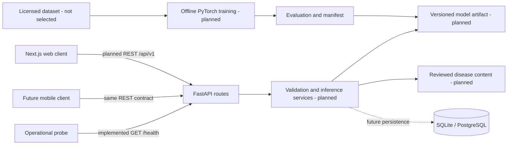

# Architecture

## Components and status

The repository is a monorepo: backend/app contains the FastAPI package, backend/tests its
tests, frontend the Next.js app, and ml the future offline ML workflow. Only health and
the static landing page run today. api, core, schemas, and services are small Python
packages with defined responsibilities. Add database models/repositories/migrations when
persistence begins; do not create unused layers now.



## Request data flow (planned)

```mermaid
sequenceDiagram
    participant Client as Web or mobile
    participant API as FastAPI
    participant Service as Inference service
    participant Model as Loaded model
    Client->>API: POST /api/v1/predictions (one image)
    API->>Service: Bounded bytes after request validation
    Service->>Service: Verify content/pixels, orient, RGB, transform
    Service->>Model: Tensor under inference_mode
    Model-->>Service: Class scores
    Service->>Service: Apply mapping and uncertainty policy
    Service-->>API: Typed prediction result
    API-->>Client: JSON, version, warnings, request ID
    Note over API,Service: Discard image; no persistence by default
```

## Backend boundaries

- api: routing, HTTP input/output, status codes; no model training or database queries.
- schemas: Pydantic request/response contracts; explicit API compatibility.
- core: settings and later application lifecycle configuration.
- services: image validation, preprocessing orchestration, inference, reviewed content.
  Add only with implementation tasks; inject a small fake for API tests.
- Future repositories/models: persistence details when a database is needed.

create_app accepts Settings for isolated tests; the default app loads root .env plus
environment variables. No credentials or database connection is required. Empty CORS
allowlist is the default; .env.example enables only the local frontend. CORS is a browser
policy, not authentication. Add POST explicitly when the upload endpoint is implemented.
Production uses explicit settings, HTTPS, constrained ingress, and no development reload.

## Training and inference

Offline training/experimentation belongs in ml/src and ml/notebooks; notebooks should call
reusable code rather than become the sole pipeline. It may use a GPU but CPU inference is
the initial target. A reviewed manifest binds class mapping, transforms, weights, version,
license and evaluation. ML dependencies are an optional extra in the sole Python manifest.
Shared transforms will need importable packaging when created; avoid duplicate transforms.
The API loads a trusted artifact once at startup and reports readiness separately from liveness.
Bound CPU execution and avoid blocking the async event loop. Each worker duplicates model
memory; start with one worker and measure before scaling.

## Communication and persistence

Use multipart upload then typed JSON over REST. No frontend framework types or cookies are
required by the anonymous API, allowing a mobile client later. /health is operational and
unversioned; business endpoints use /api/v1. Additive fields are compatible; breaking schemas
require a new version. OpenAPI reflects only implemented endpoints.

Reviewed disease information can start as versioned content. SQLite/SQLAlchemy/Alembic are
the selected persistence path, but no tables or migration commands exist yet. PostgreSQL
is a later choice for concurrent writes, with explicit driver and migration verification.
User identity, history, retention and image storage require separate design and consent.

## Deployment and tradeoffs

- One API with in-process inference minimizes cost and operational complexity, but couples
  model memory/CPU to API scaling. Separate serving or queues require measured justification.
- Separate frontend/API builds permit independent hosting, but introduce CORS and API URL
  configuration. Future public frontend environment values must never contain secrets.
- SQLite is easy locally, but has write concurrency limits. Portable models help migration,
  although PostgreSQL integration tests remain necessary.
- A small crop set improves feasibility; controlled dataset metrics do not establish field
  reliability. Abstention by score alone does not solve out-of-distribution detection.
- Docker/Compose and hosting are Phase 5; use local processes now. Later pin images, use
  non-root containers, inject production environment, mount verified artifacts, add readiness,
  request limits, HTTPS and resource budgets. Do not train models in deployment containers.

See SPEC.md for measurable limits, API schemas and ML evaluation policy; TASKS.md controls
implementation order.
